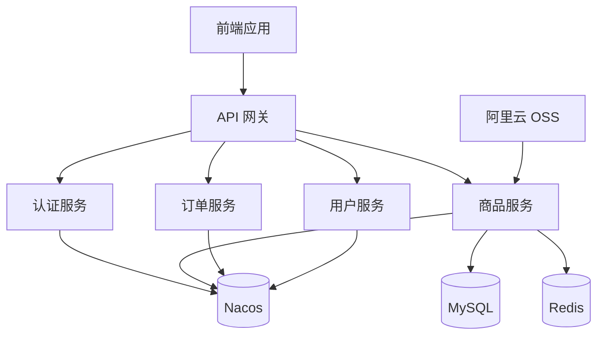
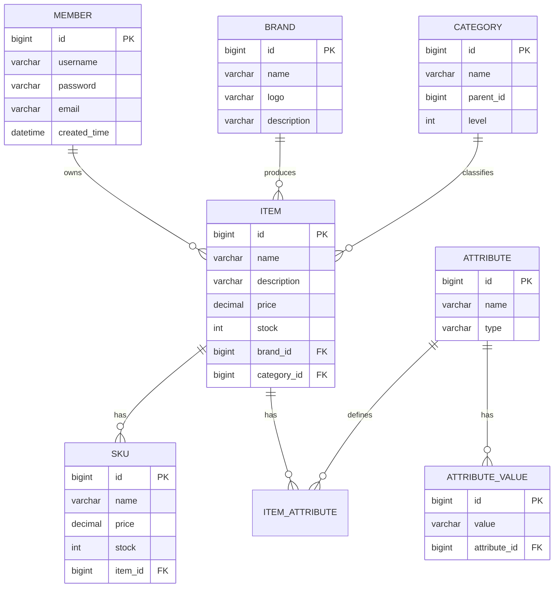

# Online Store (在线商店)

[](https://spring.io/projects/spring-boot)
[](https://spring.io/projects/spring-cloud)
[](https://openjdk.java.net/)
[](https://www.mysql.com/)
[](https://redis.io/)
[](LICENSE)

这是一个基于 Spring Cloud 的微服务在线商店系统，提供了完整的电商功能，包括商品管理、用户管理、购物车、订单处理等核心功能。

## 目录

- [功能特性](#功能特性)
- [技术栈](#技术栈)
- [项目架构](#项目架构)
- [项目结构](#项目结构)
- [运行要求](#运行要求)
- [快速开始](#快速开始)
- [API 文档](#api-文档)
- [部署](#部署)
- [数据库设计](#数据库设计)
- [贡献](#贡献)
- [许可证](#许可证)

## 功能特性

- ✅ 商品管理（商品、品牌、分类、属性）
- ✅ 用户管理（注册、登录、权限控制）
- ✅ 购物车功能
- ✅ 商品搜索与筛选
- ✅ 订单管理
- ✅ 支付集成（待实现）
- ✅ 库存管理
- ✅ 图片存储（阿里云 OSS）
- ✅ 缓存优化（Redis）
- ✅ 微服务架构（Spring Cloud + Nacos）
- ✅ 安全认证（JWT + Spring Security）

## 技术栈

### 后端技术

| 技术 | 版本 | 说明 |
|------|------|------|
| JDK | 17+ | Java 开发工具包 |
| Spring Boot | 3.4.3 | 快速应用开发框架 |
| Spring Cloud | 2024.0.0 | 微服务框架 |
| MyBatis | 3.0.3 | ORM 框架 |
| MySQL | 8.2.0 | 关系型数据库 |
| Redis | 6.0+ | 缓存数据库 |
| Nacos | 2.2.0 | 服务注册与配置中心 |
| JWT | 0.11.5 | JSON Web Token 实现 |
| Lombok | 1.18.36 | 简化 Java 代码 |

### 前端技术（待实现）

- React/Vue.js（可选）
- Ant Design/Vuetify（UI 框架）

## 项目架构



## 项目结构

```
online-store/
├── src/
│   ├── main/
│   │   ├── java/
│   │   │   └── com/example/onlinestore/
│   │   │       ├── OnlineStoreApplication.java  # 应用启动类
│   │   │       ├── controller/                 # 控制器层
│   │   │       ├── service/                    # 服务层
│   │   │       │   └── impl/                   # 服务实现
│   │   │       ├── mapper/                     # 数据访问层
│   │   │       ├── entity/                     # 实体类
│   │   │       ├── dto/                        # 数据传输对象
│   │   │       ├── bean/                       # 业务对象
│   │   │       ├── config/                     # 配置类
│   │   │       ├── security/                   # 安全配置
│   │   │       ├── enums/                      # 枚举类
│   │   │       ├── exceptions/                 # 自定义异常
│   │   │       ├── handler/                    # 处理器
│   │   │       ├── utils/                      # 工具类
│   │   │       └── constants/                  # 常量定义
│   │   └── resources/
│   │       ├── application.yaml               # 应用配置
│   │       ├── application-local.yaml         # 本地环境配置
│   │       ├── bootstrap.yaml                 # 启动配置
│   │       ├── mapper/                        # MyBatis 映射文件
│   │       ├── sql/                           # SQL 脚本
│   │       └── i18n/                          # 国际化资源
│   └── test/                                  # 测试代码
├── scripts/                                   # 脚本文件
├── pom.xml                                    # Maven 配置文件
├── Dockerfile                                 # Docker 镜像配置
├── docker-compose.yaml                        # Docker 编排配置
└── README.md                                  # 项目说明文档
```

## 运行要求

- JDK 17 或更高版本
- Maven 3.6 或更高版本
- MySQL 8.0 或更高版本
- Redis 6.0 或更高版本
- Docker (可选，用于容器化部署)

## 快速开始

### 1. 环境准备

确保已安装并运行以下服务：

```bash
# 启动 MySQL 和 Redis (使用 Docker)
docker-compose --profile all up -d

# 或者只启动 MySQL
docker-compose --profile without-redis up -d
```

### 2. 数据库配置

创建数据库：

```sql
CREATE DATABASE online_store DEFAULT CHARACTER SET utf8mb4 COLLATE utf8mb4_unicode_ci;
```

### 3. 配置文件修改

根据实际环境修改 [application.yaml](file:///data/workspace/online_store/src/main/resources/application.yaml) 中的数据库和 Redis 配置：

```yaml
spring:
  datasource:
    url: jdbc:mysql://localhost:3306/online_store?useUnicode=true&characterEncoding=utf-8&useSSL=false&serverTimezone=Asia/Shanghai
    username: your_username
    password: your_password
  data:
    redis:
      host: localhost
      port: 6379
```

### 4. 运行应用

```bash
# 添加 JVM 参数以支持 JDK 17
mvn spring-boot:run -Djvm.args="--add-opens java.base/java.lang=ALL-UNNAMED"
```

或者打包运行：

```bash
mvn clean package
java --add-opens java.base/java.lang=ALL-UNNAMED -jar target/online-store-1.0-SNAPSHOT.jar
```

### 5. 访问应用

应用启动后，可通过以下地址访问：

- 应用地址: http://localhost:8080
- Actuator 监控: http://localhost:8080/actuator

默认管理员账号：
- 用户名: admin
- 密码: admin123

## API 文档

API 文档使用 Swagger 生成，启动应用后访问：

```
http://localhost:8080/swagger-ui.html
```

主要 API 端点：

| 端点 | 方法 | 描述 |
|------|------|------|
| `/api/items` | GET | 获取商品列表 |
| `/api/items/{id}` | GET | 获取商品详情 |
| `/api/items` | POST | 创建商品 |
| `/api/items/{id}` | PUT | 更新商品 |
| `/api/items/{id}` | DELETE | 删除商品 |
| `/api/brands` | GET | 获取品牌列表 |
| `/api/categories` | GET | 获取分类列表 |
| `/api/members` | POST | 用户注册 |
| `/api/auth/login` | POST | 用户登录 |

## 部署

### Docker 部署

构建 Docker 镜像：

```bash
docker build -t online-store:latest .
```

运行容器：

```bash
docker run -d -p 8080:8080 --name online-store online-store:latest
```

### Docker Compose 部署

```bash
# 启动所有服务
docker-compose --profile all up -d
```

## 数据库设计

主要实体关系图：



## 贡献

欢迎任何形式的贡献！请遵循以下步骤：

1. Fork 项目
2. 创建功能分支 (`git checkout -b feature/AmazingFeature`)
3. 提交更改 (`git commit -m 'Add some AmazingFeature'`)
4. 推送到分支 (`git push origin feature/AmazingFeature`)
5. 开启 Pull Request

## 许可证

本项目采用 MIT 许可证，详情请见 [LICENSE](LICENSE) 文件。