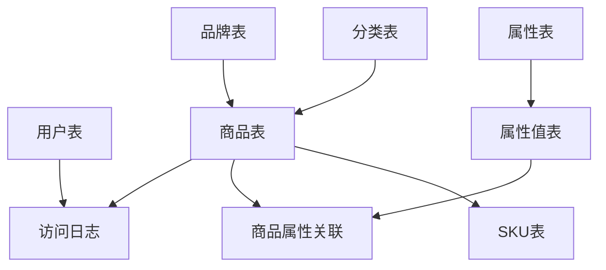

# 在线商店 (Online Store)

> 一个基于Spring Cloud微服务架构的现代化电商平台，提供完整的商品管理、用户管理、商品属性管理等功能。

[](https://spring.io/projects/spring-boot)
[](https://spring.io/projects/spring-cloud)
[](https://www.oracle.com/java/)
[](LICENSE)

## 📋 目录

- [项目简介](#项目简介)
- [核心功能](#核心功能)
- [技术栈](#技术栈)
- [项目架构](#项目架构)
- [快速开始](#快速开始)
- [API文档](#api文档)
- [数据库设计](#数据库设计)
- [配置说明](#配置说明)
- [部署指南](#部署指南)
- [开发指南](#开发指南)
- [常见问题](#常见问题)
- [贡献指南](#贡献指南)

## 🚀 项目简介

本项目是一个企业级的在线商店后端系统，采用Spring Cloud微服务架构设计，具备高可用、高并发、易扩展的特点。系统提供了完整的电商核心功能，包括商品管理、用户管理、分类管理、品牌管理等模块。

### 设计理念

- **微服务架构**: 采用Spring Cloud生态系统，支持服务发现、配置中心、负载均衡
- **领域驱动设计**: 清晰的业务模块划分，易于维护和扩展
- **安全第一**: 集成Spring Security和JWT，确保系统安全
- **高性能**: Redis缓存、数据库优化、异步处理
- **可观测性**: 完善的日志记录和监控指标

## ✨ 核心功能

### 🛍️ 商品管理
- 商品信息管理 (CRUD)
- 商品属性和规格管理
- SKU管理
- 商品分类管理
- 品牌管理
- 商品访问日志记录

### 👥 用户管理
- 用户注册和登录
- JWT身份认证
- 用户信息管理
- 权限控制

### 📊 系统管理
- 多语言支持 (i18n)
- 配置中心集成
- 健康检查
- 监控指标

## 🛠️ 技术栈

### 核心框架
- **Java 17** - 编程语言
- **Spring Boot 3.4.3** - 应用框架
- **Spring Cloud 2024.0.0** - 微服务框架
- **Spring Security 6.x** - 安全框架
- **Spring Cloud Alibaba** - 阿里云微服务组件

### 数据存储
- **MySQL 8.x** - 关系型数据库
- **Redis 6.x** - 缓存和会话存储
- **MyBatis 3.0.3** - ORM框架
- **PageHelper** - 分页插件

### 中间件
- **Nacos** - 服务发现和配置中心
- **Jedis 5.2.0** - Redis客户端
- **Aliyun OSS** - 对象存储

### 开发工具
- **Maven** - 项目构建
- **Lombok** - 代码简化
- **Jackson** - JSON处理
- **JWT** - 令牌认证

## 🏗️ 项目架构

```
src/
├── main/
│   ├── java/com/example/onlinestore/
│   │   ├── bean/              # 业务实体类
│   │   │   ├── Item.java      # 商品实体
│   │   │   ├── Member.java    # 用户实体
│   │   │   ├── Category.java  # 分类实体
│   │   │   └── ...
│   │   ├── controller/        # REST控制器
│   │   │   ├── ItemController.java
│   │   │   ├── MemberController.java
│   │   │   └── ...
│   │   ├── service/           # 业务逻辑层
│   │   │   ├── impl/         # 服务实现
│   │   │   └── ...
│   │   ├── mapper/           # 数据访问层
│   │   ├── dto/              # 数据传输对象
│   │   ├── entity/           # 数据库实体
│   │   ├── config/           # 配置类
│   │   ├── security/         # 安全相关
│   │   ├── utils/            # 工具类
│   │   ├── enums/            # 枚举类
│   │   ├── exceptions/       # 异常处理
│   │   └── constants/        # 常量定义
│   └── resources/
│       ├── mapper/           # MyBatis映射文件
│       ├── sql/              # 数据库脚本
│       ├── i18n/             # 国际化资源
│       ├── application.yaml  # 主配置文件
│       └── bootstrap.yaml    # 启动配置
├── test/                     # 测试代码
├── scripts/                  # 脚本工具
├── docker-compose.yaml       # Docker容器编排
└── pom.xml                   # Maven配置
```

## 🚀 快速开始

### 环境要求

- **JDK 17+** (推荐使用OpenJDK 17)
- **Maven 3.6+**
- **MySQL 8.0+**
- **Redis 6.0+**
- **Docker** (可选，用于容器化部署)

### 1. 克隆项目

```bash
git clone <repository-url>
cd online_store
```

### 2. 数据库初始化

#### 方式一：使用Docker Compose (推荐)

```bash
# 启动MySQL和Redis
docker-compose --profile all up -d
```

#### 方式二：手动安装

```sql
-- 创建数据库
CREATE DATABASE online_store DEFAULT CHARACTER SET utf8mb4 COLLATE utf8mb4_unicode_ci;

-- 使用数据库
USE online_store;

-- 执行数据库脚本
source src/main/resources/sql/member_table.sql;
source src/main/resources/sql/item_table_table.sql;
source src/main/resources/sql/category_table.sql;
source src/main/resources/sql/brand_table.sql;
source src/main/resources/sql/attribute_table.sql;
source src/main/resources/sql/attribute_value_table.sql;
source src/main/resources/sql/item_attribute_relation_table.sql;
source src/main/resources/sql/sku_table.sql;
source src/main/resources/sql/item_access_log_table.sql;
```

### 3. 配置环境变量

创建 `.env` 文件或设置系统环境变量：

```bash
# 数据库配置
DB_HOST=localhost
DB_PORT=3306
DB_NAME=online_store
DB_USERNAME=root
DB_PASSWORD=123456

# Redis配置
REDIS_HOST=localhost
REDIS_PORT=6379
REDIS_PASSWORD=

# JWT配置
JWT_SECRET=your-256-bit-secret-key-here

# 管理员账户
ADMIN_USERNAME=admin
ADMIN_PASSWORD=admin123

# Nacos配置 (可选)
NACOS_ENABLED=false
```

### 4. 构建和运行

```bash
# 编译项目
mvn clean compile

# 运行测试
mvn test

# 启动应用
mvn spring-boot:run

# 或者使用参数启动
mvn spring-boot:run -Dspring-boot.run.jvmArguments="--add-opens java.base/java.lang=ALL-UNNAMED"
```

### 5. 验证部署

```bash
# 健康检查
curl http://localhost:8080/actuator/health

# API测试
curl http://localhost:8080/api/v1/items/1
```

应用启动后，访问 http://localhost:8080 即可使用系统。

## 📚 API文档

### 用户管理 API

| 方法 | 路径 | 描述 | 认证 |
|------|------|------|------|
| POST | `/api/v1/members/registry` | 用户注册 | 否 |
| POST | `/api/v1/members/login` | 用户登录 | 否 |

### 商品管理 API

| 方法 | 路径 | 描述 | 认证 |
|------|------|------|------|
| GET | `/api/v1/items/{id}` | 获取商品详情 | 是 |
| GET | `/api/v1/items` | 商品列表查询 | 是 |
| POST | `/api/v1/items` | 创建商品 | 是 |
| PUT | `/api/v1/items/{id}` | 更新商品 | 是 |
| DELETE | `/api/v1/items/{id}` | 删除商品 | 是 |

### 分类管理 API

| 方法 | 路径 | 描述 | 认证 |
|------|------|------|------|
| GET | `/api/v1/categories` | 获取分类树 | 否 |
| POST | `/api/v1/categories` | 创建分类 | 是 |
| PUT | `/api/v1/categories/{id}` | 更新分类 | 是 |

### 请求示例

**用户注册**
```bash
curl -X POST http://localhost:8080/api/v1/members/registry \
  -H "Content-Type: application/json" \
  -d '{
    "username": "testuser",
    "password": "password123",
    "email": "test@example.com",
    "phone": "13800138000"
  }'
```

**用户登录**
```bash
curl -X POST http://localhost:8080/api/v1/members/login \
  -H "Content-Type: application/json" \
  -d '{
    "username": "testuser",
    "password": "password123"
  }'
```

## 🗄️ 数据库设计

### 核心表结构

- **member** - 用户信息表
- **item** - 商品基础信息表
- **sku** - 商品SKU表
- **category** - 商品分类表
- **brand** - 品牌表
- **attribute** - 属性表
- **attribute_value** - 属性值表
- **item_attribute_relation** - 商品属性关联表
- **item_access_log** - 商品访问日志表

### ER图



## ⚙️ 配置说明

### 主要配置文件

- `application.yaml` - 主配置文件
- `application-local.yaml` - 本地开发配置
- `bootstrap.yaml` - 启动配置，主要用于Nacos配置

### 关键配置项

```yaml
# 数据库配置
spring:
  datasource:
    url: jdbc:mysql://localhost:3306/online_store
    username: root
    password: 123456

# Redis配置
  data:
    redis:
      host: localhost
      port: 6379
      database: 0

# JWT配置
jwt:
  secret: ${JWT_SECRET}
  expiration: 86400  # 24小时

# MyBatis配置
mybatis:
  mapper-locations: classpath:mapper/*.xml
  type-aliases-package: com.example.onlinestore.model
  configuration:
    map-underscore-to-camel-case: true
```

## 🐳 部署指南

### Docker部署

```bash
# 构建镜像
docker build -t online-store:latest .

# 运行容器
docker run -d \
  --name online-store \
  -p 8080:8080 \
  -e DB_HOST=your-db-host \
  -e DB_PASSWORD=your-db-password \
  -e JWT_SECRET=your-jwt-secret \
  online-store:latest
```

### 生产环境部署

1. **环境准备**
   - JDK 17运行环境
   - MySQL 8.0数据库
   - Redis缓存服务
   - Nacos配置中心 (可选)

2. **打包应用**
   ```bash
   mvn clean package -Dmaven.test.skip=true
   ```

3. **启动应用**
   ```bash
   java -jar \
     --add-opens java.base/java.lang=ALL-UNNAMED \
     -Xms512m -Xmx2g \
     -Dspring.profiles.active=prod \
     target/online-store-1.0-SNAPSHOT.jar
   ```

## 👨‍💻 开发指南

### 代码规范

- 使用Java 17语法特性
- 遵循阿里巴巴Java开发手册
- 使用Lombok简化代码
- 接口和实现分离
- 统一异常处理

### 开发流程

1. 创建功能分支
2. 编写代码和测试
3. 代码审查
4. 合并到主分支
5. 部署测试

### 测试

```bash
# 运行所有测试
mvn test

# 运行特定测试类
mvn test -Dtest=MemberControllerTest

# 生成测试报告
mvn surefire-report:report
```

## ❓ 常见问题

### Q: 启动时出现 "IllegalAccessError" 错误？
**A:** 添加JVM参数：`--add-opens java.base/java.lang=ALL-UNNAMED`

### Q: 数据库连接失败？
**A:** 检查数据库配置和网络连接，确保MySQL服务正在运行。

### Q: Redis连接超时？
**A:** 检查Redis配置和服务状态，确保端口6379可访问。

### Q: JWT token验证失败？
**A:** 确认JWT_SECRET环境变量已正确设置。

### Q: 如何启用Nacos？
**A:** 设置环境变量 `NACOS_ENABLED=true` 并配置Nacos服务地址。

## 🤝 贡献指南

我们欢迎所有形式的贡献！请阅读以下指南：

1. Fork项目
2. 创建特性分支 (`git checkout -b feature/AmazingFeature`)
3. 提交更改 (`git commit -m 'Add some AmazingFeature'`)
4. 推送到分支 (`git push origin feature/AmazingFeature`)
5. 打开Pull Request

### 提交规范

- feat: 新功能
- fix: 修复bug
- docs: 文档更新
- style: 代码格式调整
- refactor: 代码重构
- test: 测试相关
- chore: 构建过程或工具变动

## 📄 许可证

本项目使用 [MIT 许可证](LICENSE)。

## 📞 联系我们

- 项目主页: [GitHub Repository]
- 问题反馈: [GitHub Issues]
- 邮箱: developer@example.com

---

> 💡 **提示**: 如果你觉得这个项目有用，请给我们一个 ⭐️！

**快乐编程！** 🎉 