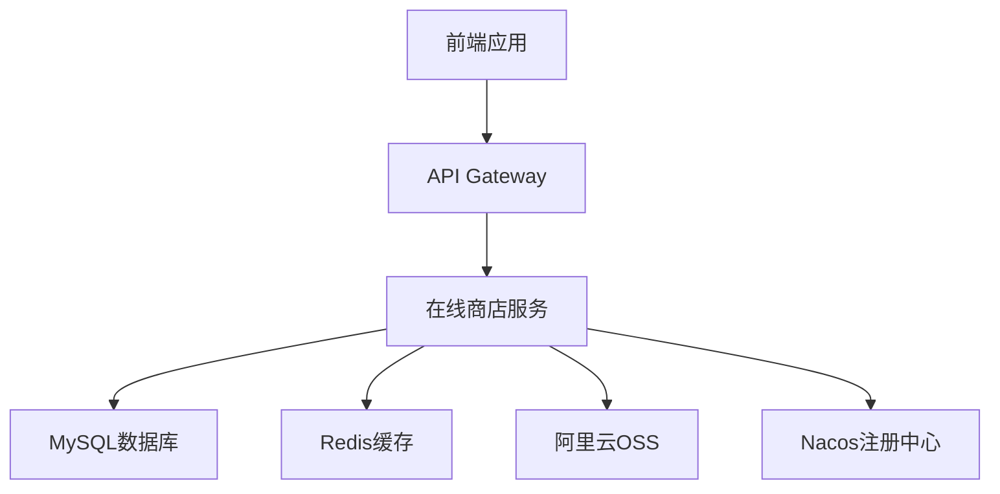

# 🛒 Online Store - 在线商店系统

[](https://openjdk.org/)
[](https://spring.io/projects/spring-boot)
[](https://spring.io/projects/spring-cloud)
[](https://www.mysql.com/)
[](https://redis.io/)

> 基于Spring Cloud微服务架构的现代化在线商店系统，集成了用户管理、商品管理、订单处理、支付系统等完整的电商功能。

## 📋 目录

- [功能特性](#-功能特性)
- [系统架构](#-系统架构)
- [技术栈](#-技术栈)
- [项目结构](#-项目结构)
- [快速开始](#-快速开始)
- [部署指南](#-部署指南)
- [API文档](#-api文档)
- [开发指南](#-开发指南)
- [贡献指南](#-贡献指南)
- [许可证](#-许可证)

## 🚀 功能特性

### 🔐 用户管理
- 用户注册/登录/注销
- JWT身份认证
- 角色权限管理
- 用户信息管理

### 📦 商品管理
- 商品分类管理
- 商品信息CRUD
- 商品库存管理
- 商品搜索与筛选

### 🛍️ 购物功能
- 购物车管理
- 订单创建与管理
- 订单状态跟踪
- 支付集成

### 📊 系统功能
- 阿里云OSS文件存储
- Redis缓存机制
- 数据分页查询
- 国际化支持
- 系统监控与健康检查

## 🏗️ 系统架构



## 🛠️ 技术栈

### 后端技术
- **Java**: 17 (LTS版本)
- **Spring Boot**: 3.4.3
- **Spring Cloud**: 2024.0.0
- **Spring Security**: 身份认证与授权
- **MyBatis**: 3.0.3 (数据持久层)
- **PageHelper**: 2.1.0 (分页查询)

### 数据库与缓存
- **MySQL**: 8.2.0 (主数据库)
- **Redis**: 最新版 (缓存与会话)
- **Jedis**: 5.2.0 (Redis客户端)

### 服务治理
- **Nacos**: 2.2.0 (服务注册与配置管理)
- **Spring Cloud Alibaba**: 2022.0.0.0

### 工具库
- **JWT**: io.jsonwebtoken 0.11.5 (Token生成)
- **Lombok**: 1.18.36 (代码简化)
- **Apache Commons**: 通用工具类
- **阿里云OSS SDK**: 3.18.1 (文件存储)

### 构建工具
- **Maven**: 3.6+
- **Docker**: 容器化部署
- **Docker Compose**: 服务编排

## 📁 项目结构

```
online-store/
├── src/
│   ├── main/
│   │   ├── java/com/example/onlinestore/
│   │   │   ├── OnlineStoreApplication.java    # 主启动类
│   │   │   ├── config/                        # 配置类
│   │   │   ├── controller/                    # 控制器层
│   │   │   ├── service/                       # 业务逻辑层
│   │   │   ├── mapper/                        # 数据访问层
│   │   │   ├── entity/                        # 实体类
│   │   │   ├── dto/                           # 数据传输对象
│   │   │   ├── security/                      # 安全配置
│   │   │   ├── utils/                         # 工具类
│   │   │   ├── exceptions/                    # 异常处理
│   │   │   └── enums/                         # 枚举类
│   │   └── resources/
│   │       ├── application.yaml               # 主配置文件
│   │       ├── application-local.yaml         # 本地环境配置
│   │       ├── bootstrap.yaml                 # 启动配置
│   │       ├── mapper/                        # MyBatis映射文件
│   │       ├── sql/                           # 数据库脚本
│   │       └── i18n/                          # 国际化资源
│   └── test/                                  # 测试代码
├── scripts/                                   # 工具脚本
├── docker-compose.yaml                        # Docker编排文件
├── Dockerfile                                 # Docker镜像构建文件
├── pom.xml                                    # Maven配置文件
└── README.md                                  # 项目说明文档
``` 

## 🚀 快速开始

### 环境要求

- **Java**: JDK 17 或更高版本
- **Maven**: 3.6+ 
- **MySQL**: 8.0+
- **Redis**: 6.0+
- **Docker**: 20.10+ (可选)
- **Docker Compose**: 2.0+ (可选)

### 本地开发环境搭建

#### 1. 克隆项目
```bash
git clone <repository-url>
cd online-store
```

#### 2. 数据库初始化
```sql
-- 连接MySQL并创建数据库
CREATE DATABASE online_store DEFAULT CHARACTER SET utf8mb4 COLLATE utf8mb4_unicode_ci;

-- 创建用户并授权
CREATE USER 'online_store'@'%' IDENTIFIED BY '123456';
GRANT ALL PRIVILEGES ON online_store.* TO 'online_store'@'%';
FLUSH PRIVILEGES;
```

#### 3. 配置环境变量
```bash
# 设置JWT密钥(必须)
export JWT_SECRET=your-jwt-secret-key-here

# 可选:设置管理员账号
export ADMIN_USERNAME=admin
export ADMIN_PASSWORD=admin123

# 可选:启用Nacos
export NACOS_ENABLED=false
```

#### 4. 修改配置文件
根据需要修改 `src/main/resources/application-local.yaml`:

```yaml
spring:
  datasource:
    url: jdbc:mysql://localhost:3306/online_store?useUnicode=true&characterEncoding=utf-8&useSSL=false&serverTimezone=Asia/Shanghai
    username: online_store
    password: 123456
  data:
    redis:
      host: localhost
      port: 6379
      password: # 如果有密码请填写
```

#### 5. 运行应用
```bash
# 使用Maven运行
mvn clean spring-boot:run

# 或者打包后运行
mvn clean package
java --add-opens java.base/java.lang=ALL-UNNAMED -jar target/online-store-1.0-SNAPSHOT.jar
```

#### 6. 验证安装
访问: `http://localhost:8080/actuator/health`

预期响应:
```json
{
  "status": "UP"
}
```

## 🐳 Docker 部署

### 使用 Docker Compose (推荐)

```bash
# 启动所有服务(包括MySQL和Redis)
docker-compose --profile all up -d

# 仅启动MySQL
docker-compose --profile without-redis up -d

# 停止服务
docker-compose down
```

### 手动Docker部署

#### 1. 构建应用镜像
```bash
# 打包应用
mvn clean package -DskipTests

# 构建 Docker 镜像
docker build -t online-store:latest .
```

#### 2. 运行容器
```bash
docker run -d \
  --name online-store \
  -p 8080:8080 \
  -e JWT_SECRET=your-jwt-secret \
  -e SPRING_PROFILES_ACTIVE=local \
  online-store:latest
```

### 生产环境部署

#### 环境变量配置
```bash
# 必要的环境变量
export SPRING_PROFILES_ACTIVE=prod
export JWT_SECRET=production-jwt-secret-key
export MYSQL_HOST=your-mysql-host
export MYSQL_PORT=3306
export MYSQL_DATABASE=online_store
export MYSQL_USERNAME=your-username
export MYSQL_PASSWORD=your-password
export REDIS_HOST=your-redis-host
export REDIS_PORT=6379
export REDIS_PASSWORD=your-redis-password
```

#### 性能优化建议
- 启用 Redis 缓存
- 配置数据库连接池
- 使用 CDN 加速静态资源
- 定期清理日志文件

## 📚 API 文档

### 基本信息
- **基本 URL**: `http://localhost:8080`
- **认证方式**: JWT Bearer Token
- **数据格式**: JSON

### 主要端点

#### 用户管理
```http
POST /api/auth/login       # 用户登录
POST /api/auth/register    # 用户注册
GET  /api/users/profile    # 获取用户信息
PUT  /api/users/profile    # 更新用户信息
```

#### 商品管理
```http
GET    /api/products         # 获取商品列表
GET    /api/products/{id}    # 获取商品详情
POST   /api/products         # 创建商品
PUT    /api/products/{id}    # 更新商品
DELETE /api/products/{id}    # 删除商品
```

#### 订单管理
```http
GET  /api/orders           # 获取订单列表
POST /api/orders           # 创建订单
GET  /api/orders/{id}      # 获取订单详情
PUT  /api/orders/{id}      # 更新订单状态
```

### 认证示例
```bash
# 1. 登录获取Token
curl -X POST http://localhost:8080/api/auth/login \
  -H "Content-Type: application/json" \
  -d '{"username":"admin","password":"admin123"}'

# 2. 使用Token访问受保护的接口
curl -X GET http://localhost:8080/api/users/profile \
  -H "Authorization: Bearer YOUR_JWT_TOKEN"
```

## 🔧 开发指南

### 代码规范
- 使用 [Google Java Style Guide](https://google.github.io/styleguide/javaguide.html)
- 使用 Lombok 减少样板代码
- Controller 层仅负责请求处理，业务逻辑放在 Service 层
- 使用 `@Transactional` 管理事务

### 数据库设计
- 使用下划线命名规范 (snake_case)
- 所有表必须包含 `created_at` 和 `updated_at` 字段
- 使用逻辑删除，增加 `deleted_at` 字段

### 测试
```bash
# 运行单元测试
mvn test

# 运行集成测试
mvn integration-test

# 生成测试覆盖率报告
mvn jacoco:report
```

### 日志级别
- `ERROR`: 系统错误、异常
- `WARN`: 警告信息
- `INFO`: 重要业务信息
- `DEBUG`: 调试信息

## 🔍 监控与运维

### 健康检查
```bash
# 应用健康状态
curl http://localhost:8080/actuator/health

# 数据库连接状态
curl http://localhost:8080/actuator/health/db

# Redis连接状态
curl http://localhost:8080/actuator/health/redis
```

### 监控指标
```bash
# JVM 信息
curl http://localhost:8080/actuator/metrics/jvm.memory.used

# HTTP 请求统计
curl http://localhost:8080/actuator/metrics/http.server.requests

# 数据库连接池
curl http://localhost:8080/actuator/metrics/hikaricp.connections
```

## 🤝 贡献指南

我们欢迎任何形式的贡献!

### 贡献流程
1. Fork 项目
2. 创建特性分支 (`git checkout -b feature/amazing-feature`)
3. 提交修改 (`git commit -m 'Add some amazing feature'`)
4. 推送到分支 (`git push origin feature/amazing-feature`)
5. 创建 Pull Request

### 代码贡献要求
- 确保代码符合项目编码规范
- 添加适当的单元测试
- 更新相关文档
- 确保所有测试通过

### 问题报告
发现问题请通过 [Issues](../../issues) 提交，包含以下信息:
- 操作系统和版本
- Java 版本
- 错误复现步骤
- 错误日志和截图

## 📄 更新日志

### v1.0.0 (2025-09-25)
- ✨ 初始版本发布
- ✨ 完整的用户管理系统
- ✨ 商品管理功能
- ✨ 订单处理系统
- ✨ JWT 身份认证
- ✨ Redis 缓存集成
- ✨ 阿里云 OSS 集成
- ✨ Docker 部署支持

## 📝 许可证

本项目采用 MIT 许可证 - 查看 [LICENSE](LICENSE) 文件了解详情。

## 🙏 致谢

感谢以下开源项目和社区的支持:
- [Spring Boot](https://spring.io/projects/spring-boot)
- [Spring Cloud](https://spring.io/projects/spring-cloud)
- [MyBatis](https://mybatis.org/)
- [Nacos](https://nacos.io/)
- [Redis](https://redis.io/)
- [MySQL](https://www.mysql.com/)

---

<div align="center">
  <p>如果这个项目对您有帮助，请给个⭐️支持一下!</p>
  <p>Made with ❤️ by <a href="#">开发团队</a></p>
</div> 