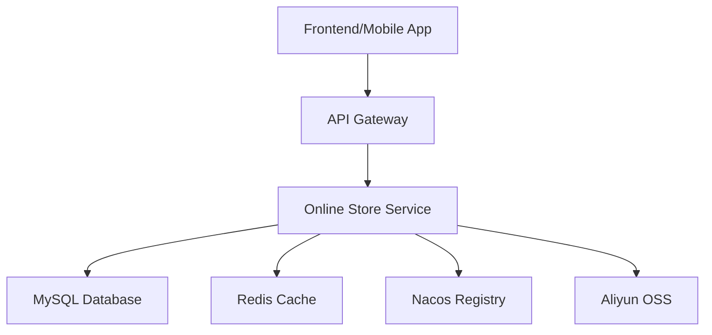

# Online Store 🛍️

> A modern e-commerce platform built with Spring Cloud microservices architecture

[](https://openjdk.java.net/projects/jdk/17/)
[](https://spring.io/projects/spring-boot)
[](https://spring.io/projects/spring-cloud)
[](https://www.mysql.com/)
[](https://redis.io/)

## 📋 Table of Contents

- [Features](#-features)
- [Tech Stack](#-tech-stack)
- [Architecture](#-architecture)
- [Project Structure](#-project-structure)
- [Prerequisites](#-prerequisites)
- [Quick Start](#-quick-start)
- [Configuration](#-configuration)
- [API Documentation](#-api-documentation)
- [Docker Support](#-docker-support)
- [Development](#-development)
- [Contributing](#-contributing)
- [License](#-license)

## ✨ Features

### Core E-commerce Functionality
- 🛒 **Product Management**: Complete item catalog with categories, brands, and attributes
- 👤 **User Management**: Member registration, authentication, and profile management
- 🔍 **Product Search**: Advanced search with category and brand filtering
- 📱 **RESTful APIs**: Comprehensive REST API for frontend integration
- 🔐 **Security**: JWT-based authentication with Spring Security
- 📊 **Analytics**: Access logging and user behavior tracking

### Technical Features
- ⚡ **Caching**: Redis-based caching for improved performance
- 🏛️ **Database**: MyBatis ORM with MySQL for data persistence
- 🌐 **Microservices**: Spring Cloud architecture with Nacos discovery (optional)
- 📄 **Pagination**: Built-in pagination support with PageHelper
- 🌍 **Internationalization**: Multi-language support with i18n
- 🔄 **Auto-configuration**: Profile-based configuration management
- 📤 **File Storage**: Aliyun OSS integration for file uploads

## 🛠 Tech Stack

### Backend Framework
- **Java 17** - Modern JDK with latest features
- **Spring Boot 3.4.3** - Application framework
- **Spring Cloud 2024.0.0** - Microservices toolkit
- **Spring Security 6.x** - Authentication and authorization
- **Spring Data Redis** - Redis integration

### Database & Persistence
- **MySQL 8.2.0** - Primary database
- **MyBatis 3.0.3** - SQL mapping framework
- **PageHelper 2.1.0** - Pagination plugin
- **Redis 6.0+** - Caching and session storage

### Service Discovery & Configuration
- **Nacos 2.2.0** - Service discovery and configuration management
- **Spring Cloud Alibaba** - Alibaba Cloud integration

### Security & Authentication
- **JWT (JJWT 0.11.5)** - JSON Web Token implementation
- **BCrypt** - Password hashing

### Utilities & Tools
- **Lombok** - Boilerplate code reduction
- **Apache Commons Lang3** - Utility libraries
- **Jackson** - JSON processing
- **Aliyun OSS** - Object storage service

## 🏗 Architecture



## 📁 Project Structure

```
online-store/
├── src/
│   ├── main/
│   │   ├── java/com/example/onlinestore/
│   │   │   ├── OnlineStoreApplication.java     # Main application class
│   │   │   ├── controller/                     # REST controllers
│   │   │   │   ├── MemberController.java       # User management
│   │   │   │   ├── ItemController.java         # Product management
│   │   │   │   ├── BrandController.java        # Brand management
│   │   │   │   ├── CategoryController.java     # Category management
│   │   │   │   └── AttributeController.java    # Product attributes
│   │   │   ├── service/                        # Business logic layer
│   │   │   │   ├── impl/                       # Service implementations
│   │   │   │   └── interfaces/                 # Service interfaces
│   │   │   ├── mapper/                         # MyBatis mappers
│   │   │   ├── entity/                         # Database entities
│   │   │   ├── dto/                            # Data transfer objects
│   │   │   ├── bean/                           # Business objects
│   │   │   ├── config/                         # Configuration classes
│   │   │   ├── handler/                        # Exception handlers
│   │   │   └── utils/                          # Utility classes
│   │   └── resources/
│   │       ├── application.yaml                # Main configuration
│   │       ├── application-local.yaml          # Local development config
│   │       ├── bootstrap.yaml                  # Bootstrap configuration
│   │       ├── mapper/                         # MyBatis XML mappers
│   │       ├── sql/                           # Database scripts
│   │       └── i18n/                          # Internationalization files
│   └── test/                                  # Test classes
├── scripts/                                   # Utility scripts
├── docker-compose.yaml                        # Docker services
├── Dockerfile                                 # Application container
├── pom.xml                                   # Maven dependencies
└── README.md                                 # Project documentation
```

## 📋 Prerequisites

### Required Software
- **JDK 17** or higher
- **Maven 3.6+** for dependency management
- **MySQL 8.0+** for data storage
- **Redis 6.0+** for caching

### Optional Tools
- **Docker & Docker Compose** for containerized deployment
- **Nacos Server** for service discovery (if enabled)
- **Git** for version control

## 🚀 Quick Start

### 1. Clone the Repository
```bash
git clone <repository-url>
cd online_store
```

### 2. Database Setup
```sql
-- Create database
CREATE DATABASE online_store DEFAULT CHARACTER SET utf8mb4 COLLATE utf8mb4_unicode_ci;

-- Create user (optional)
CREATE USER 'online_store'@'localhost' IDENTIFIED BY 'your_password';
GRANT ALL PRIVILEGES ON online_store.* TO 'online_store'@'localhost';
FLUSH PRIVILEGES;
```

### 3. Environment Configuration
Create a `.env` file or set environment variables:
```bash
# Database
MYSQL_PASSWORD=123456

# JWT Security
JWT_SECRET=your-secret-key-here

# Admin Credentials
ADMIN_USERNAME=admin
ADMIN_PASSWORD=admin123

# Optional: Nacos Configuration
NACOS_ENABLED=false
```

### 4. Run with Docker (Recommended)
```bash
# Start dependencies (MySQL + Redis)
docker-compose up -d

# Build and run the application
mvn clean package
java -jar target/online-store-1.0-SNAPSHOT.jar
```

### 5. Run Locally
```bash
# Ensure MySQL and Redis are running
# Update configuration in application-local.yaml if needed

# Add JVM arguments for Java 17 compatibility
export MAVEN_OPTS="--add-opens java.base/java.lang=ALL-UNNAMED"

# Run the application
mvn spring-boot:run
```

### 6. Verify Installation
```bash
# Health check
curl http://localhost:8080/actuator/health

# API test
curl http://localhost:8080/api/v1/categories/1
```

## ⚙️ Configuration

### Profiles
- **local**: Local development (default)
- **dev**: Development environment
- **prod**: Production environment

### Key Configuration Files
- `application.yaml`: Main configuration
- `application-local.yaml`: Local development overrides
- `bootstrap.yaml`: Bootstrap configuration for Nacos

### Environment Variables
| Variable | Description | Default |
|----------|-------------|----------|
| `SPRING_PROFILES_ACTIVE` | Active profile | `local` |
| `MYSQL_PASSWORD` | MySQL password | `123456` |
| `JWT_SECRET` | JWT signing key | **Required** |
| `NACOS_ENABLED` | Enable Nacos discovery | `false` |
| `ADMIN_USERNAME` | Admin username | `admin` |
| `ADMIN_PASSWORD` | Admin password | `admin123` |

## 📚 API Documentation

### Authentication
```bash
# Member Registration
POST /api/v1/members/registry
Content-Type: application/json
{
  "name": "username",
  "password": "password",
  "email": "user@example.com"
}

# Member Login
POST /api/v1/members/login
Content-Type: application/json
{
  "username": "username",
  "password": "password"
}
```

### Product Management
```bash
# Get Item Details
GET /api/v1/items/{itemId}

# Get Item Detail with SKUs
GET /api/v1/items/{itemId}/detail

# List Categories
GET /api/v1/categories/{categoryId}

# List Brands
GET /api/v1/brands?pageNum=1&pageSize=10&visible=1
```

### Brand Management
```bash
# Create Brand
POST /api/v1/brands

# Update Brand
PUT /api/v1/brands/{brandId}

# Delete Brand
DELETE /api/v1/brands/{brandId}
```

## 🐳 Docker Support

### Using Docker Compose
```bash
# Start all services
docker-compose up -d

# View logs
docker-compose logs -f

# Stop services
docker-compose down
```

### Custom Docker Build
```bash
# Build application image
docker build -t online-store .

# Run with custom network
docker run -d --name online-store-app \
  --network online-store-network \
  -p 8080:8080 \
  -e MYSQL_PASSWORD=123456 \
  -e JWT_SECRET=your-secret \
  online-store
```

## 👩‍💻 Development

### Setting up Development Environment
1. **IDE Setup**: Import as Maven project in IntelliJ IDEA or Eclipse
2. **Lombok Plugin**: Install Lombok plugin for your IDE
3. **Code Style**: Follow Google Java Style Guide
4. **Database**: Use local MySQL instance or Docker container

### Running Tests
```bash
# Run all tests
mvn test

# Run specific test class
mvn test -Dtest=MemberServiceTest

# Run with coverage
mvn clean test jacoco:report
```

### Common Development Tasks
```bash
# Clean and compile
mvn clean compile

# Package without tests
mvn clean package -DskipTests

# Run with debug
mvn spring-boot:run -Dspring-boot.run.jvmArguments="-Xdebug -Xrunjdwp:transport=dt_socket,server=y,suspend=n,address=5005"
```

## 🤝 Contributing

1. Fork the repository
2. Create a feature branch (`git checkout -b feature/amazing-feature`)
3. Commit your changes (`git commit -m 'Add some amazing feature'`)
4. Push to the branch (`git push origin feature/amazing-feature`)
5. Open a Pull Request

### Code Standards
- Follow Java naming conventions
- Write comprehensive unit tests
- Document public APIs with JavaDoc
- Use meaningful commit messages

## 📄 License

This project is licensed under the MIT License - see the [LICENSE](LICENSE) file for details.

---

## 📞 Support

For questions and support:
- 📧 Email: support@example.com
- 💬 Issues: [GitHub Issues](issues)
- 📖 Wiki: [Project Wiki](wiki)

**Happy Coding! 🎉** 