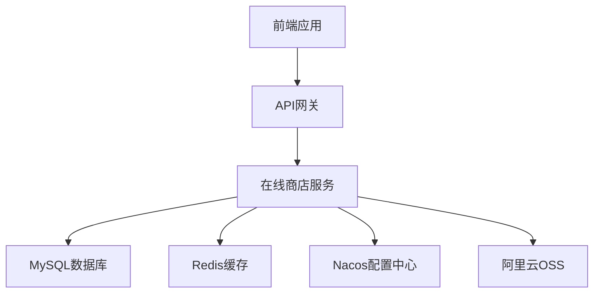

# 在线商店系统 (Online Store)

[](LICENSE)


基于Spring Cloud的微服务在线商店系统，提供商品管理、用户管理、订单处理等电商核心功能。

## 目录
- [功能特性](#功能特性)
- [技术栈](#技术栈)
- [项目结构](#项目结构)
- [系统架构](#系统架构)
- [运行要求](#运行要求)
- [快速开始](#快速开始)
- [API文档](#api文档)
- [配置说明](#配置说明)
- [部署方式](#部署方式)
- [测试](#测试)
- [贡献](#贡献)
- [许可证](#许可证)

## 功能特性

- 🛍️ 商品管理：商品分类、品牌、属性管理
- 👥 用户管理：用户注册、登录、权限控制
- 🔐 安全认证：JWT Token认证与授权
- 🛒 购物车功能
- 📦 订单管理
- 🔍 商品搜索与筛选
- 🖼️ 图片存储（阿里云OSS）
- 🔄 微服务架构支持
- ⚙️ 配置中心集成（Nacos）

## 技术栈

### 后端技术

| 技术 | 版本 | 说明 |
|------|------|------|
| JDK | 17 | Java开发工具包 |
| Spring Boot | 3.4.3 | 快速应用开发框架 |
| Spring Cloud | 2024.0.0 | 微服务框架 |
| MyBatis | 3.0.3 | ORM框架 |
| MySQL | 8.2.0 | 关系型数据库 |
| Redis | 5.2.0 | 缓存数据库 |
| Nacos | 2.2.0 | 服务发现与配置中心 |
| JWT | 0.11.5 | JSON Web Token实现 |

### 开发工具

- Maven 3.6+
- Lombok 1.18.36
- PageHelper 分页插件

## 项目结构

```
online-store/
├── src/
│   ├── main/
│   │   ├── java/com/example/onlinestore/
│   │   │   ├── OnlineStoreApplication.java  # 应用启动类
│   │   │   ├── controller/                  # 控制器层
│   │   │   ├── service/                     # 业务逻辑层
│   │   │   ├── mapper/                      # 数据访问层
│   │   │   ├── entity/                      # 实体类
│   │   │   ├── dto/                         # 数据传输对象
│   │   │   ├── bean/                        # Bean配置
│   │   │   ├── config/                      # 配置类
│   │   │   ├── security/                    # 安全配置
│   │   │   ├── enums/                       # 枚举类
│   │   │   ├── exceptions/                  # 自定义异常
│   │   │   ├── utils/                       # 工具类
│   │   │   └── constants/                   # 常量定义
│   │   └── resources/
│   │       ├── application.yaml             # 主配置文件
│   │       ├── bootstrap.yaml               # 启动配置文件
│   │       └── mapper/                      # MyBatis映射文件
│   └── test/                                # 测试代码
├── scripts/                                 # 脚本文件
├── pom.xml                                  # Maven配置文件
├── Dockerfile                               # Docker镜像构建文件
└── docker-compose.yaml                      # Docker容器编排文件
```

## 系统架构



## 运行要求

- JDK 17 或更高版本
- Maven 3.6 或更高版本
- MySQL 8.0 或更高版本
- Redis 6.0 或更高版本
- Docker (可选，用于容器化部署)

## 快速开始

### 1. 数据库准备

创建数据库：
```sql
CREATE DATABASE online_store DEFAULT CHARACTER SET utf8mb4 COLLATE utf8mb4_unicode_ci;
```

### 2. 环境配置

修改 [application.yaml](src/main/resources/application.yaml) 文件中的数据库和Redis配置：
```yaml
spring:
  datasource:
    url: jdbc:mysql://localhost:3306/online_store?useUnicode=true&characterEncoding=utf-8&useSSL=false&serverTimezone=Asia/Shanghai
    username: your_username
    password: your_password
  data:
    redis:
      host: localhost
      port: 6379
```

### 3. 运行应用

使用Maven运行：
```bash
mvn spring-boot:run
```

或者打包后运行：
```bash
mvn clean package
java -jar target/online-store-1.0-SNAPSHOT.jar
```

## API文档

应用启动后，可以通过以下地址访问API文档：
- Swagger UI: `http://localhost:8080/swagger-ui.html`
- API文档: `http://localhost:8080/v3/api-docs`

主要API端点：
- `/api/items` - 商品相关接口
- `/api/categories` - 商品分类接口
- `/api/brands` - 品牌管理接口
- `/api/users` - 用户管理接口
- `/api/auth` - 认证相关接口

## 配置说明

### 环境变量

| 变量名 | 默认值 | 说明 |
|--------|--------|------|
| ADMIN_USERNAME | admin | 管理员用户名 |
| ADMIN_PASSWORD | admin123 | 管理员密码 |
| JWT_SECRET | (空) | JWT密钥 |
| NACOS_ENABLED | false | 是否启用Nacos |
| SPRING_PROFILES_ACTIVE | local | 激活的配置文件 |

### Profile配置

- `local`: 本地开发环境
- `dev`: 开发环境
- `test`: 测试环境
- `prod`: 生产环境

## 部署方式

### 传统部署

1. 打包应用：
```bash
mvn clean package -DskipTests
```

2. 运行应用：
```bash
java -jar target/online-store-1.0-SNAPSHOT.jar
```

### Docker部署

1. 构建Docker镜像：
```bash
docker build -t online-store .
```

2. 使用Docker Compose启动所有服务：
```bash
docker-compose --profile all up -d
```

只启动必需服务（不包括Redis）：
```bash
docker-compose --profile without-redis up -d
```

## 测试

运行单元测试：
```bash
mvn test
```

运行集成测试：
```bash
mvn verify
```

生成测试覆盖率报告：
```bash
mvn jacoco:report
```

## 贡献

欢迎提交Issue和Pull Request来改进这个项目。

1. Fork仓库
2. 创建功能分支 (`git checkout -b feature/AmazingFeature`)
3. 提交更改 (`git commit -m 'Add some AmazingFeature'`)
4. 推送到分支 (`git push origin feature/AmazingFeature`)
5. 开启Pull Request

## 许可证

本项目采用MIT许可证，详情请见 [LICENSE](LICENSE) 文件。