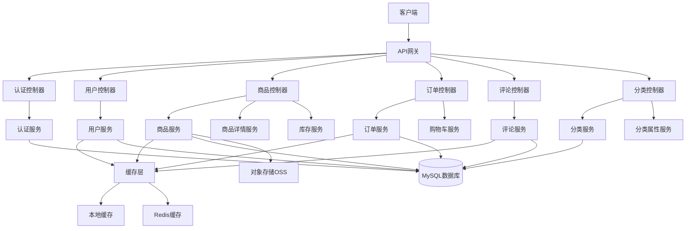
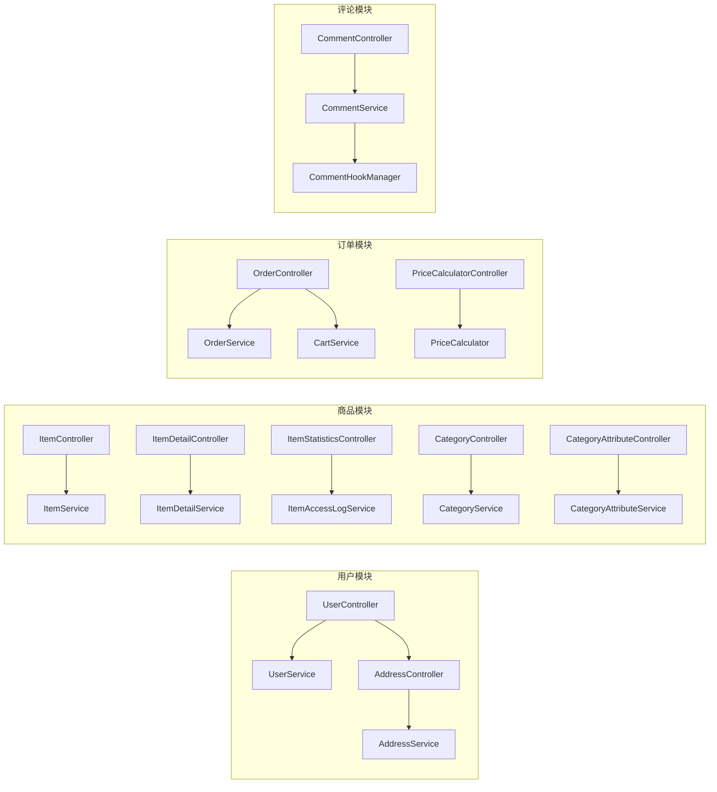
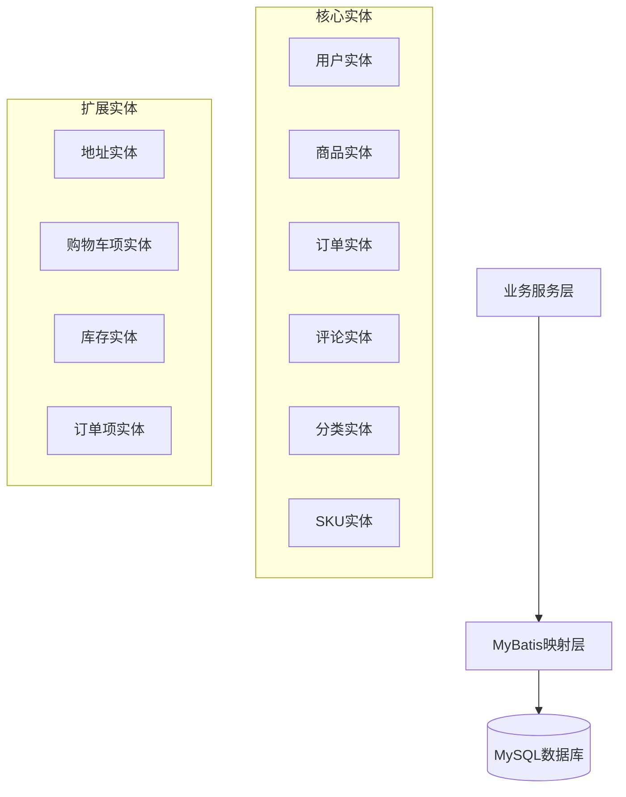

# Online Store

这是一个基于Spring Cloud的在线商店项目。

## 系统架构

### 整体架构图



### 核心模块架构



### 数据层架构



## 技术栈

- JDK 17
- Spring Cloud 2022.0.4
- Spring Boot 3.1.5
- MyBatis 3.0.2
- MySQL 8.0
- Redis (Jedis 4.3.1)

## 项目结构

```
online-store/
├── src/
│   ├── main/
│   │   ├── java/
│   │   │   └── com/
│   │   │       └── example/
│   │   │           └── onlinestore/
│   │   │               ├── OnlineStoreApplication.java
│   │   │               ├── controller/
│   │   │               ├── service/
│   │   │               ├── mapper/
│   │   │               └── entity/
│   │   └── resources/
│   │       ├── application.yml
│   │       └── mapper/
│   └── test/
├── pom.xml
└── README.md
```

## 运行要求

- JDK 17或更高版本
- Maven 3.6或更高版本
- MySQL 8.0
- Redis 6.0或更高版本

## 如何运行

1. 确保MySQL和Redis服务已启动
2. 创建数据库：
```sql
CREATE DATABASE online_store DEFAULT CHARACTER SET utf8mb4 COLLATE utf8mb4_unicode_ci;
```
3. 修改`application.yml`中的数据库和Redis配置
4. 添加vm参数：`--add-opens java.base/java.lang=ALL-UNNAMED` 
4. 运行应用程序：
```bash
mvn spring-boot:run
``` 