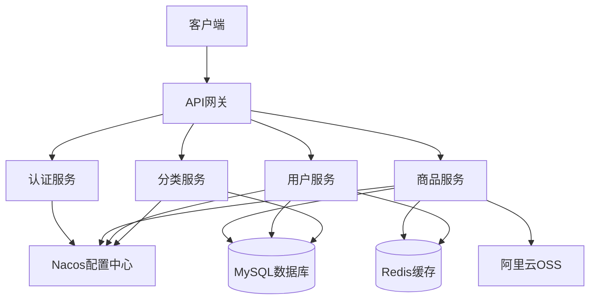

# Online Store 🛒

> 基于 Spring Boot 3.x 和 Spring Cloud 2024.x 构建的现代化在线商店系统


## 📋 项目概述

Online Store 是一个功能完善的电商后端系统，提供商品管理、用户认证、分类管理等核心功能。项目采用微服务架构设计，支持分布式部署，具备高可用性和可扩展性。

### ✨ 核心功能

- 🛍️ **商品管理**: 商品CRUD操作、SKU管理、属性配置
- 👥 **用户管理**: 会员注册、JWT认证、个人信息管理  
- 📂 **分类管理**: 层级分类结构、分类状态管理
- 🏷️ **品牌管理**: 品牌信息维护、可见性控制
- 🔧 **属性管理**: 商品属性定义、属性值管理
- 📊 **访问统计**: 商品访问日志记录
- 📁 **文件存储**: 阿里云OSS集成

### 🎯 适用场景

- 中小型电商平台后端系统
- 商品管理系统
- 微服务架构学习项目
- Spring Boot 最佳实践参考

## 🏗️ 技术架构

### 核心技术栈

| 技术栈 | 版本 | 说明 |
|--------|------|------|
| **JDK** | 17+ | Java运行环境 |
| **Spring Boot** | 3.4.3 | 应用框架 |
| **Spring Cloud** | 2024.0.0 | 微服务套件 |
| **Spring Security** | 6.x | 安全框架 |
| **MyBatis** | 3.0.3 | ORM框架 |
| **MySQL** | 8.2.0 | 关系数据库 |
| **Redis** | Latest | 缓存数据库 |
| **Nacos** | 2.2.0 | 配置中心/服务发现 |
| **JWT** | 0.11.5 | 认证令牌 |
| **Aliyun OSS** | 3.18.1 | 对象存储 |

### 系统架构图



### 项目结构

```
online-store/
├── src/main/java/com/example/onlinestore/
│   ├── OnlineStoreApplication.java      # 应用启动类
│   ├── bean/                            # 业务实体
│   │   ├── Item.java                   # 商品实体
│   │   ├── Member.java                 # 用户实体
│   │   ├── Category.java               # 分类实体
│   │   └── ...
│   ├── controller/                      # REST接口层
│   │   ├── ItemController.java         # 商品接口
│   │   ├── MemberController.java       # 用户接口
│   │   ├── CategoryController.java     # 分类接口
│   │   └── ...
│   ├── service/                        # 业务逻辑层
│   │   ├── ItemService.java           # 商品服务
│   │   ├── MemberService.java         # 用户服务
│   │   └── ...
│   ├── mapper/                         # 数据访问层
│   ├── dto/                           # 数据传输对象
│   ├── config/                        # 配置类
│   ├── security/                      # 安全配置
│   └── utils/                         # 工具类
├── src/main/resources/
│   ├── mapper/                        # MyBatis映射文件
│   ├── sql/                          # 数据库建表脚本
│   ├── i18n/                         # 国际化资源
│   ├── application.yaml              # 主配置文件
│   └── application-local.yaml        # 本地配置
├── src/test/                          # 测试代码
├── scripts/                           # 脚本工具
├── docker-compose.yaml               # Docker编排
└── pom.xml                           # Maven配置
```

## 🚀 快速开始

### 环境要求

| 软件 | 版本要求 | 说明 |
|------|----------|------|
| JDK | 17+ | Java开发环境 |
| Maven | 3.6+ | 项目构建工具 |
| MySQL | 8.0+ | 数据库服务 |
| Redis | 6.0+ | 缓存服务 |
| Docker | 20.0+ | 容器化部署(可选) |

### 🐳 Docker 快速启动 (推荐)

```bash
# 1. 启动基础服务(MySQL + Redis)
docker-compose --profile all up -d

# 2. 创建数据库
docker exec -it online_store_mysql_1 mysql -u root -p123456 -e \
  "CREATE DATABASE IF NOT EXISTS online_store DEFAULT CHARACTER SET utf8mb4 COLLATE utf8mb4_unicode_ci;"

# 3. 初始化数据表
for sql_file in src/main/resources/sql/*.sql; do
  docker exec -i online_store_mysql_1 mysql -u root -p123456 online_store < "$sql_file"
done

# 4. 设置环境变量并启动应用
export JWT_SECRET="mySecretKey123456789012345678901234567890"
mvn spring-boot:run
```

### 🔧 本地开发启动

```bash
# 1. 克隆项目
git clone <repository-url>
cd online-store

# 2. 启动MySQL和Redis服务
# MySQL: 端口3306, 用户名root, 密码123456
# Redis: 端口6379, 无密码

# 3. 创建数据库
mysql -u root -p -e "CREATE DATABASE online_store DEFAULT CHARACTER SET utf8mb4 COLLATE utf8mb4_unicode_ci;"

# 4. 执行建表脚本
for sql_file in src/main/resources/sql/*.sql; do
  mysql -u root -p online_store < "$sql_file"
done

# 5. 设置环境变量
export JWT_SECRET="mySecretKey123456789012345678901234567890"
export MYSQL_PASSWORD="123456"

# 6. 启动应用
mvn spring-boot:run
```

### ✅ 验证安装

访问以下端点验证服务状态：

```bash
# 健康检查
curl http://localhost:8080/actuator/health

# 获取商品信息(需要先创建测试数据)
curl http://localhost:8080/api/v1/items/1

# 用户注册
curl -X POST http://localhost:8080/api/v1/members/registry \
  -H "Content-Type: application/json" \
  -d '{"username":"test","password":"123456","email":"test@example.com"}'
```

## 📡 API 文档

### 接口规范

所有API接口遵循RESTful设计规范，使用统一的响应格式：

```json
{
  "code": 200,
  "message": "success",
  "data": {},
  "timestamp": 1640995200000
}
```

### 核心接口

#### 🛍️ 商品管理

| 方法 | 路径 | 描述 |
|------|------|------|
| GET | `/api/v1/items/{id}` | 获取商品详情 |
| POST | `/api/v1/items` | 创建商品 |
| PUT | `/api/v1/items/{id}` | 更新商品 |
| DELETE | `/api/v1/items/{id}` | 删除商品 |

#### 👥 用户管理

| 方法 | 路径 | 描述 |
|------|------|------|
| POST | `/api/v1/members/registry` | 用户注册 |
| POST | `/api/v1/members/login` | 用户登录 |
| GET | `/api/v1/members/profile` | 获取用户信息 |

#### 📂 分类管理

| 方法 | 路径 | 描述 |
|------|------|------|
| GET | `/api/v1/categories/{id}` | 获取分类详情 |
| GET | `/api/v1/categories` | 获取分类列表 |

#### 🏷️ 品牌管理

| 方法 | 路径 | 描述 |
|------|------|------|
| GET | `/api/v1/brands` | 获取品牌列表 |
| GET | `/api/v1/brands/{id}` | 获取品牌详情 |
| POST | `/api/v1/brands` | 创建品牌 |
| PUT | `/api/v1/brands/{id}` | 更新品牌 |
| DELETE | `/api/v1/brands/{id}` | 删除品牌 |

#### 🔧 属性管理

| 方法 | 路径 | 描述 |
|------|------|------|
| GET | `/api/v1/attributes/{id}` | 获取属性详情 |
| POST | `/api/v1/attributes` | 创建属性 |
| PUT | `/api/v1/attributes/{id}` | 更新属性 |

## 🚀 部署指南

### 环境配置

项目支持多环境配置：

- **local**: 本地开发环境(默认)
- **dev**: 开发测试环境  
- **prod**: 生产环境

### 配置文件说明

| 文件 | 用途 |
|------|------|
| `application.yaml` | 主配置文件 |
| `application-local.yaml` | 本地环境配置 |
| `bootstrap.yaml` | 启动配置(Nacos相关) |

### 环境变量

| 变量名 | 必填 | 默认值 | 说明 |
|--------|------|--------|------|
| `JWT_SECRET` | ✅ | 无 | JWT密钥(32位以上) |
| `MYSQL_PASSWORD` | ❌ | 123456 | MySQL密码 |
| `NACOS_ENABLED` | ❌ | false | 是否启用Nacos |
| `SPRING_PROFILES_ACTIVE` | ❌ | local | 激活的配置文件 |

### Docker 部署

```bash
# 1. 构建镜像
mvn clean package
docker build -t online-store:1.0 .

# 2. 运行容器
docker run -d \
  --name online-store \
  -p 8080:8080 \
  -e JWT_SECRET="mySecretKey123456789012345678901234567890" \
  -e MYSQL_PASSWORD="your_mysql_password" \
  online-store:1.0
```

### 传统部署

```bash
# 1. 打包应用
mvn clean package -DskipTests

# 2. 运行JAR包
export JWT_SECRET="mySecretKey123456789012345678901234567890"
java -jar target/online-store-1.0-SNAPSHOT.jar \
  --spring.profiles.active=prod \
  --add-opens java.base/java.lang=ALL-UNNAMED
```

## 👨‍💻 开发指南

### 开发环境配置

1. **IDE配置**: 推荐使用IntelliJ IDEA或VS Code
2. **代码风格**: 遵循阿里巴巴Java开发手册
3. **Git提交**: 使用[Conventional Commits](https://conventionalcommits.org/)规范

### 代码规范

| 规范类型 | 说明 | 示例 |
|---------|------|------|
| 类命名 | 大驼峰命名法 | `ItemController` |
| 方法命名 | 小驼峰命名法 | `getItemById` |
| 包命名 | 小写+点分隔 | `com.example.onlinestore` |
| 数据库表 | 下划线分隔 | `item_table` |
| API路径 | RESTful风格 | `/api/v1/items/{id}` |

### 测试策略

```bash
# 运行单元测试
mvn test

# 运行集成测试
mvn verify

# 生成测试报告
mvn jacoco:report
```

### 数据库管理

项目提供完整的数据库建表脚本，位于 `src/main/resources/sql/` 目录：

| 脚本文件 | 说明 |
|---------|------|
| `item_table_table.sql` | 商品主表 |
| `sku_table.sql` | SKU规格表 |
| `member_table.sql` | 用户信息表 |
| `category_table.sql` | 商品分类表 |
| `brand_table.sql` | 品牌信息表 |
| `attribute_table.sql` | 属性定义表 |
| `attribute_value_table.sql` | 属性值表 |
| `item_attribute_relation_table.sql` | 商品属性关联表 |
| `item_access_log_table.sql` | 商品访问日志表 |

## 🤝 贡献指南

我们欢迎所有形式的贡献！请遵循以下步骤：

1. **Fork** 本仓库
2. **创建**特性分支: `git checkout -b feature/AmazingFeature`
3. **提交**更改: `git commit -m 'Add some AmazingFeature'`
4. **推送**分支: `git push origin feature/AmazingFeature`
5. **创建** Pull Request

### 代码贡献规范

- 确保代码通过所有测试
- 添加必要的单元测试
- 更新相关文档
- 遵循项目代码风格

## 📄 许可证

本项目采用 [MIT License](LICENSE) 许可证。

## 🔗 相关链接

- [Spring Boot 官方文档](https://spring.io/projects/spring-boot)
- [Spring Cloud 官方文档](https://spring.io/projects/spring-cloud)
- [MyBatis 官方文档](https://mybatis.org/mybatis-3/)
- [Nacos 官方文档](https://nacos.io/)

## 💬 问题反馈

如果您在使用过程中遇到问题，请通过以下方式联系我们：

- 提交 [GitHub Issue](../../issues)
- 发送邮件至项目维护者
- 参与社区讨论

---

<div align="center">
  <strong>⭐ 如果这个项目对您有帮助，请给个 Star 支持一下！</strong>
</div> 