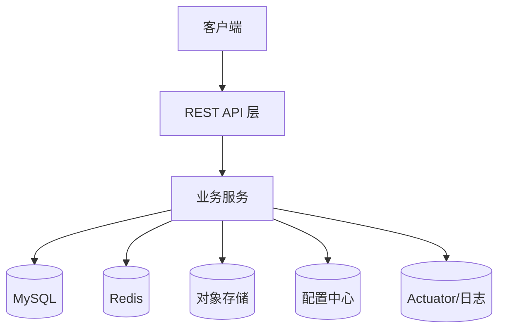

# Online Store

这是一个基于Spring Cloud的在线商店项目。

## 技术栈

- JDK 17
- Spring Cloud 2022.0.4
- Spring Boot 3.1.5
- MyBatis 3.0.2
- MySQL 8.0
- Redis (Jedis 4.3.1)

## 项目结构

```
online-store/
├── src/
│   ├── main/
│   │   ├── java/
│   │   │   └── com/
│   │   │       └── example/
│   │   │           └── onlinestore/
│   │   │               ├── OnlineStoreApplication.java
│   │   │               ├── controller/
│   │   │               ├── service/
│   │   │               ├── mapper/
│   │   │               └── entity/
│   │   └── resources/
│   │       ├── application.yaml
│   │       └── mapper/
│   └── test/
├── pom.xml
└── README.md
```

## 运行要求

- JDK 17或更高版本
- Maven 3.6或更高版本
- MySQL 8.0
- Redis 6.0或更高版本

## 如何运行

1. 确保MySQL和Redis服务已启动
2. 创建数据库：
```sql
CREATE DATABASE online_store DEFAULT CHARACTER SET utf8mb4 COLLATE utf8mb4_unicode_ci;
```
3. 修改`application.yml`中的数据库和Redis配置
4. 添加 VM 参数：`--add-opens java.base/java.lang=ALL-UNNAMED`
5. 运行应用程序：
```bash
mvn spring-boot:run
```

## 项目概览
一个基于 Spring Cloud 的在线商店系统，支持商品管理、属性与属性值、品牌与分类、会员注册与登录，集成 JWT 认证、Redis 缓存、Nacos 配置管理与 OSS 文件上传。

## 特性与模块
- 核心模块：`controller`、`service`、`mapper`、`entity`、`config`、`security`、`utils`
- 主启动类：`OnlineStoreApplication.java`
- 安全：`security` 模块内含 JWT 认证（如 `JwtAuthenticationFilter.java`、`JwtTokenUtil.java`）
- 配置：`config` 模块（Web、Redis、Security、MyBatis、OSS 等）

## 系统架构概览


## 快速开始
### 本地运行
- 数据库初始化：参见 `src/main/resources/sql`
- 配置：修改 `src/main/resources/application.yaml`（以及 `application-local.yaml` 如需本地 Profile）与 `bootstrap.yaml`（Nacos 等）
- 必需 VM 参数：`--add-opens java.base/java.lang=ALL-UNNAMED`
- 启动：`mvn spring-boot:run`

### 容器运行（可选）
- 使用根目录 `docker-compose.yaml` 启动：`docker compose up -d`
- 自定义环境变量与挂载卷请参考 compose 文件与 `application.yaml`

## 配置与环境
- 主要配置文件：`application.yaml`、`application-local.yaml`、`bootstrap.yaml`
- 关键能力：Nacos 配置管理、Redis 缓存、OSS 文件上传、JWT 认证
- 数据库与缓存：MySQL 8.0、Redis 6.0+

## 接口与安全
- 认证：基于 JWT 的登录与鉴权流程
- 接口入口：参见 `src/main/java/com/example/onlinestore/controller`

## 数据与存储
- 初始化 SQL 与示例数据：`src/main/resources/sql`
- MyBatis 映射：`src/main/resources/mapper` 与 `mapper` 接口

## 运行与观测
- 健康检查：`/actuator/health`
- 常见日志位置与级别：参考 Spring Boot 默认日志配置，可在 `application.yaml` 中调整

## 测试与质量
- 测试目录：`src/test/java`
- 定向测试执行：依据项目规范运行单测，示例可参考 `MessageSourceTest.java`

## 脚本与工具
- `scripts/README.md`：常用任务说明（如生成测试集数据）

## 故障排查与 FAQ
- 启动失败：检查数据库连接、Redis 可用性、Nacos 配置项与 VM 参数
- 认证异常：核对 JWT 配置与请求头携带的 Token
- 配置不生效：确认 Profile 与 `bootstrap.yaml`/Nacos 的优先级

## 贡献指南
- 流程：分支→提交→PR→代码评审→合并→发布
- 规范：统一术语、保持 `application.yaml` 命名一致，更新 README 的入口与链接

## 许可证
- 当前仓库未明确许可证，请依据组织规范补充并在此声明