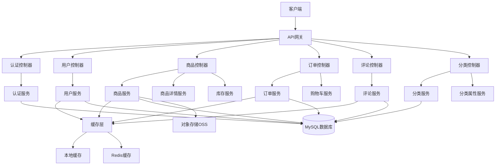
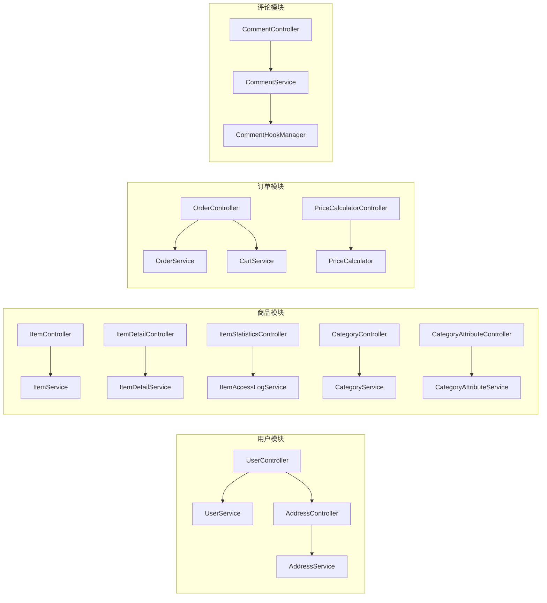
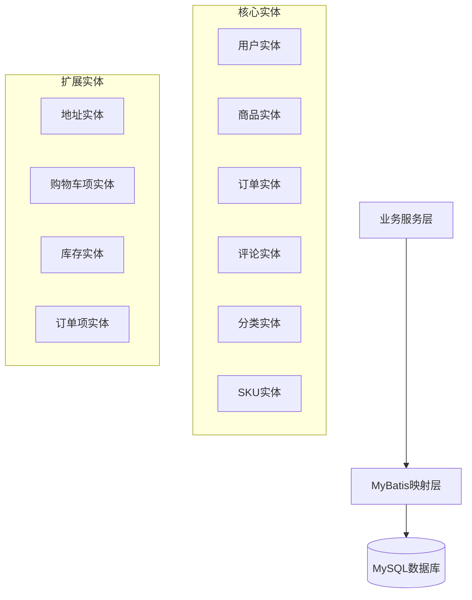

# Git Diff Extractor

从 Git 仓库提交历史中提取 diff 信息，生成 JSONL 格式的代码审查训练数据集。

## 系统架构

### 整体架构图


```mermaid
graph TB
    Client[客户端] --> Gateway[API网关]
    Gateway --> AuthC[认证控制器]
    Gateway --> UserC[用户控制器]
    Gateway --> ItemC[商品控制器]
    Gateway --> OrderC[订单控制器]
    Gateway --> CommentC[评论控制器]
    Gateway --> CategoryC[分类控制器]
    
    AuthC --> AuthS[认证服务]
    UserC --> UserS[用户服务]
    ItemC --> ItemS[商品服务]
    ItemC --> ItemDetailS[商品详情服务]
    ItemC --> InventoryS[库存服务]
    OrderC --> OrderS[订单服务]
    OrderC --> CartS[购物车服务]
    CommentC --> CommentS[评论服务]
    CategoryC --> CategoryS[分类服务]
    CategoryC --> CategoryAttrS[分类属性服务]
    
    UserS --> CacheLayer[缓存层]
    ItemS --> CacheLayer
    OrderS --> CacheLayer
    CommentS --> CacheLayer
    
    CacheLayer --> LocalCache[本地缓存]
    CacheLayer --> Redis[Redis缓存]
    
    AuthS --> MySQL[(MySQL数据库)]
    UserS --> MySQL
    ItemS --> MySQL
    OrderS --> MySQL
    CommentS --> MySQL
    CategoryS --> MySQL
    
    ItemS --> OSS[对象存储OSS]
```

### 核心模块架构


```mermaid
graph LR
    subgraph "用户模块"
        UserController --> UserService
        UserController --> AddressController
        AddressController --> AddressService
    end
    
    subgraph "商品模块"
        ItemController --> ItemService
        ItemDetailController --> ItemDetailService
        ItemStatisticsController --> ItemAccessLogService
        CategoryController --> CategoryService
        CategoryAttributeController --> CategoryAttributeService
    end
    
    subgraph "订单模块"
        OrderController --> OrderService
        OrderController --> CartService
        PriceCalculatorController --> PriceCalculator
    end
    
    subgraph "评论模块"
        CommentController --> CommentService
        CommentService --> CommentHookManager
    end
```

### 数据层架构


```mermaid
graph TB
    Service[业务服务层] --> Mapper[MyBatis映射层]
    Mapper --> MySQL[(MySQL数据库)]
    
    subgraph "核心实体"
        UserEntity[用户实体]
        ItemEntity[商品实体]
        OrderEntity[订单实体]
        CommentEntity[评论实体]
        CategoryEntity[分类实体]
        SkuEntity[SKU实体]
    end
    
    subgraph "扩展实体"
        AddressEntity[地址实体]
        CartItemEntity[购物车项实体]
        InventoryEntity[库存实体]
        OrderItemEntity[订单项实体]
    end
```

## 技术栈

- **Python 3.12+**
- **GitPython** — Git 仓库操作
- **jsonlines** — JSONL 文件输出
- **uv** — 依赖管理

## 快速开始

### 安装依赖

```bash
uv sync
```

### 运行

```bash
uv run git-diff-extractor --max-commits 100 --output output/test.jsonl
# 或
uv run python -m git_diff_extractor --max-commits 100 --output output/test.jsonl
```

### 参数说明

| 参数 | 默认值 | 说明 |
|------|--------|------|
| `--repo` | 项目根目录 | Git 仓库路径 |
| `--max-commits` | 100 | 最大处理的提交数 |
| `--output` | `output/test.jsonl` | 输出文件路径 |
| `--prefix` | `E.` | 提交信息过滤前缀，多个用逗号分隔 |
| `--summary` | 无 | 概要统计输出的 JSON 文件路径 |
| `--author` | 无 | 按作者名/邮箱子串过滤提交 |

## 输出格式

每行一条 JSON 记录，包含：

- `message` — 提交信息
- `category_label` — 分类标签（提交信息的前缀）
- `patches` — 文件变更列表，每项包含路径、旧文件内容、新文件内容和 diff

## 过滤规则

仅保留提交信息以指定前缀开头的记录（默认 `E.`，可通过 `--prefix` 修改）。

## 项目结构

```
src/git_diff_extractor/
├── cli.py          # CLI 参数解析与编排
├── extractor.py    # Git 仓库交互与 diff 提取
├── models.py       # 数据模型（FileChange, CommitData, Summary）
├── output.py       # 过滤、JSONL 写入、统计
└── exceptions.py   # 异常层次
```

## 测试

```bash
uv run pytest
```

## License

MIT
